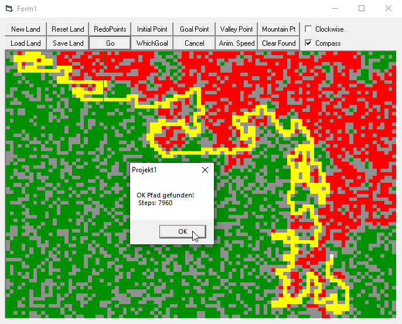

# GamePathFinder
## A simple Pathfinding algorithm extended with a compass  
Compass is just, that in every step it knows in which direction the goal is.
I adopted the code to VB from a Delphi-code I found on the Internet around the year 2000
I do not know the homepage anymore, I guess it was a homepage of a programming teacher.
Project started in June 2007

