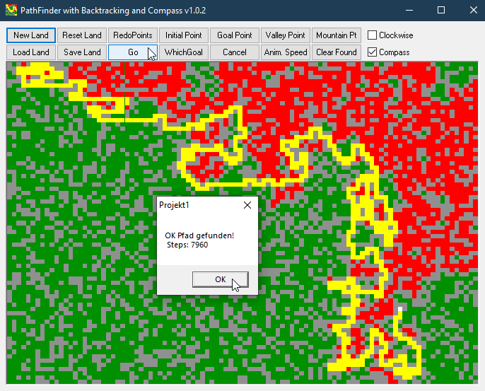

# Game_PathFinder  
## A path-finding with backtracking algorithm extended with a compass  

 

With the compass-feature it tells the algorithm only the direction of the goal.
I ported the code to VB from "Irrgarten" a Delphi-code written by Joachim Mohr.
Someday during my Delphi development-days, around the year 2005, surfing the net, I stumbled across this neat code. 
You can still find the original code here:   
[Irrgarten](https://kilchb.de/backtracking.php)  
  
I added some buttons and the compass-feature, otherwise it very much looks like the original code in Delphi.
Green is land, like walking on green grass, grey are rocks like not-climbable mountains.
The compass-feature maybe looks like "cheating", but it is so sad to watch it missing 
the goal even if it is just one step away.  
Project started in June 2007

